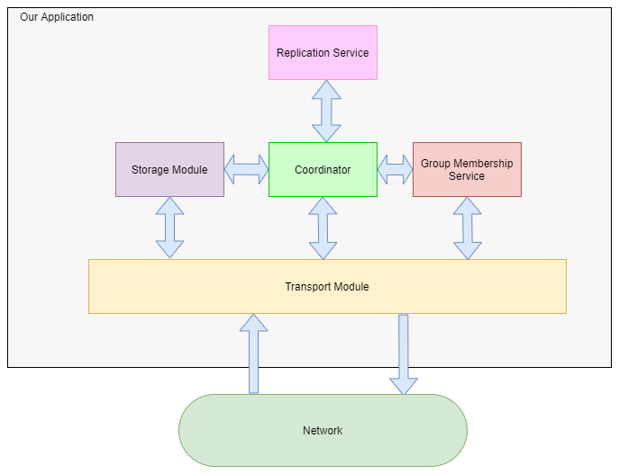
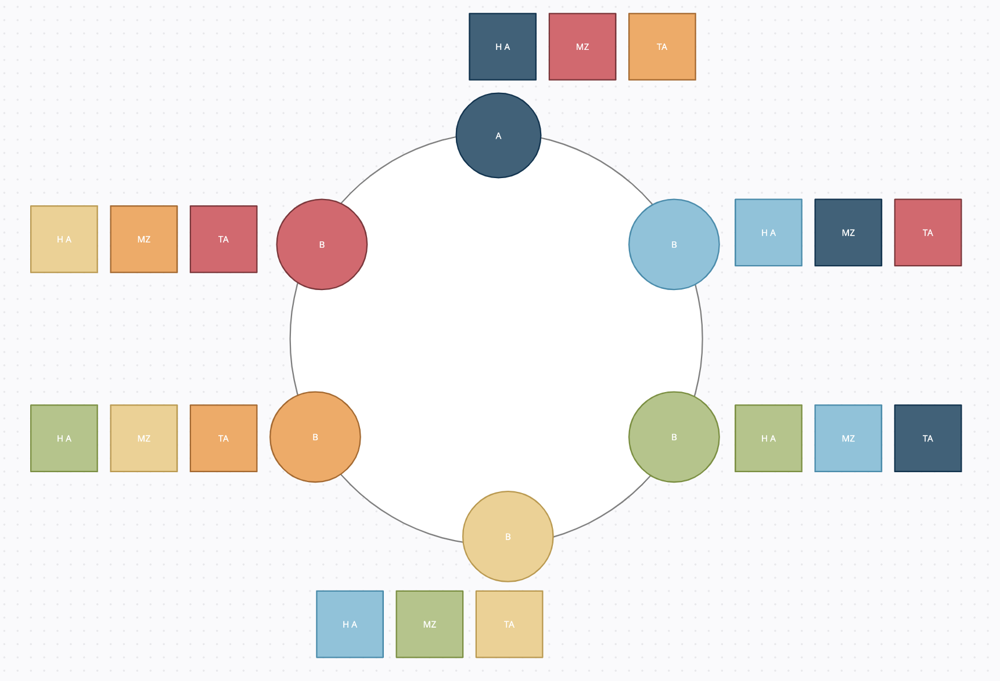

# Spirit of Fire: Distributed Hash Table
Team members: Dhruv Patel, Caleb Sattler, Danny Lee, Patrick Huang

##### Verification code : 2CE3F2F (check ./results/results.md for log)

### Instructions
1. To build the project, run the command: `docker build -t dht .`
2. To run the project, run the command: `docker run --network host -p 7262/udp -v /root/mount:/etc/cpen431 dht ./dht-server 7262 /etc/cpen431/servers.txt &`
    - For example, if servers.txt exists in "/root/mount/servers.txt" in the host, then run the command: `docker run --network host -p 7262/udp -v /root/mount:/etc/cpen431 dht ./dht-server 7262 /etc/cpen431/servers.txt &`

### Special Note for Milestone 3
In milestone 3, we implemented a primary-backup scheme to provide sequential consistency even in the case of node failures. This is a design decision we made as a team because our milestone 2 implementation was already mostly sequentially consistent and one of the primary deliverables of milestone 3 is to provide stronger sequential consistency; only in the event of failures was our system not sequentially consistent at the level of the keys. 

In doing so, we sacrifice raw performance. Because our primary-backup is inspired by 2-phase commit, we are limited by the number of rounds the primary needs to communicate with its backup and the round-trip time. We have tried to optimize our code by using multiple workers to process kv requests, sending network calls on a child thread, and using pointer channels instead of protobuf channels to reduce the copy overhead when inserting and removing from the channel. However, all these attempts lowered our througput/goodput.

### System Overview


Spirit of Fire's distributed hash table (DHT) is composed of 5 components: the transport layer, the storage component, the coordinator, the replication service, and the group membership service.

Sitting at the base of the application, the transport layer allows high-level services to communicate with other nodes via UDP and TCP while upholding at-most-once semantics via a message cache.

The storage module handles the key-value store operations, including client requests, and migrating keys when a node joins the system, or a node in the system fails. 

The replication follows a similar replica placement strategy as the [Hibari](http://www.snookles.com/scott/publications/erlang2010-slf.pdf) placement strategy: Each node contains a head, a middle, and a tail table.
As long as there are three or more nodes in the system, each of these tables is a part of a different chain.


Figure: Replica placement strategy

The group membership service maintains a list of all nodes in the system using a [push-based gossip protocol described in Indranil Gupta](https://courses.engr.illinois.edu/cs425/fa2014/L4.fa14.pdf). 

### Transport Layer
Transport has 4 ports for handling I/O:
1. ````PORT+0```` is a UDP Port; multiplex and used for forwarding messages between nodes and handelling client request 
2. ````PORT+1```` is a TCP Port; used exclusively for coordinator to coordinator communications
3. ````PORT+2````  is a UDP Port for high throughput key migration 
4. ````PORT+3````  is a UDP Port for high throughput gossipe messeging service 

Transport layer has listener daemons on each of these ports with chans to forward those messages in order to send these messages we use a function call.

### Storage Service
The storage service module maintains a map based key-value store, and executes consistent hasing for key distribution amongst nodes using SHA256.

### Coordinator Service
CoordinatorService is responsible for responding to external inputs (i.e.: client-to-server requests, server-to-server requests) and internal inputs (GMS events). Client update requests are routed to the head node of the chain, then propagated down its chain to the successor's middle table and the grand-successor's tail table. After the request has been handled at the tail node, the response is sent to the client. When the GMS notifies the coordinator about new nodes or failed nodes, the coordinator will re-distribute the keys in the system to maintain the chain replication's fault-tolerance invariant.

### Group Membership Service
Spirit of Fire's Group Membership Service (GMS) implements a push-based gossip protocol based on [Lecture 4: Failure Detection and Membership by Indranil Gupta (Indy)](https://courses.engr.illinois.edu/cs425/fa2014/L4.fa14.pdf). To summarize, each node sends a heartbeat message to a subset of its membership list every cycle. When a node receives a heartbeat message, it marks the local time at which the sender sent a heartbeat message. Periodically, it runs a fail routine and cleanup routine which marks nodes as failed if no heartbeat was sent. When it detects a new node or failed node, the GMS will notify the other components.


