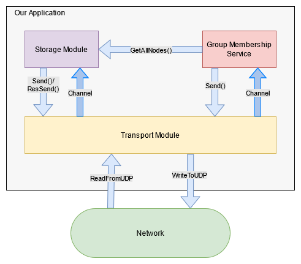

# Spirit of Fire: Distributed Hash Table
Team members: Dhruv Patel, Caleb Sattler, Danny Lee, Patrick Huang

### Instructions
1. To build the project, run the command: `docker build -t dht .`
2. To run the project, run the command: `docker run --network host -p 7262/udp -v /root/mount:/etc/cpen431 dht ./dht-server 7262 /etc/cpen431/servers.txt &`
    - For example, if servers.txt exists in "/root/mount/servers.txt" in the host, then run the command: `docker run --network host -p 7262/udp -v /root/mount:/etc/cpen431 dht ./dht-server 7262 /etc/cpen431/servers.txt &`

### System Overview

Spirit of Fire's distributed hash table (DHT) is composed of 3 components in Milestone 1: the transport layer, the storage component, and the group membership service.

Sitting at the base of the application, the transport layer allows the storage component and the group membership service to communicate with other nodes via UDP while upholding at-most-once semantics via a message cache.

The storage service manages the distributed hash table functionality. When it receives a request from the transport layer either sent by a client or another node, the storage service processes it by:
1. obtaining a list of the current nodes in the system from the group membership service,
2. determining who could be responsible for the request by consistent-hashing.
3. Forward the request to another node if itself is not responsible, or handle the request.
When the client sends to a request to one node, it may receive a response from another if the initial destination was not responsible for the message in the message sample space.

The group membership service maintains a list of all nodes in the system using a [push-based gossip protocol described in Indranil Gupta](https://courses.engr.illinois.edu/cs425/fa2014/L4.fa14.pdf). To summarize, each node sends a heartbeat message to a subset of its membership list every cycle. When a node receives a heartbeat message, it marks the local time at which the sender sent a heartbeat message. Periodically, it runs a fail routine and cleanup routine which marks nodes as failed if no heartbeat was sent.

### Transport Layer
We used the same transport layer from PA2 but we refactored it to take less space (10X less) and we switched from modular to OOP paradigm 
### Storage Service
The storage service module maintains a map based key-value store, and executes consistent hasing for key distribution amongst nodes using SHA256.
 
### Group Membership Service
Spirit of Fire's Group Membership Service (GMS) implements a push-based gossip protocol based on [Lecture 4: Failure Detection and Membership by Indranil Gupta (Indy)](https://courses.engr.illinois.edu/cs425/fa2014/L4.fa14.pdf). 

When a new node **A** joins the system by requesting to join **B**, **A** exchanges its membership list with **B**. After the exchange, each  node merges the new content into their own list. After this operation, node **A** and node **B** have identical membership lists.

To let others know that itself is alive, every node periodically (i.e.: every ***T_heartbeat*** ms) sends a heartbeat message to a subset of its membership list. When a node receives a heartbeat messages, it updates a timestamp which tracks the local time at which the receiver received a heartbeat from the sender.

To monitor failures, the node periodically checks for failures and periodically. More specifically, 
1. Every ***T_fail*** ms, the node scans through the membership list, and marks a node as "failed" if a heartbeat message hasn't been received in the window \[T_now-T_fail, T_now\]. 
2. Every ***T_cleanup*** ms, the node scans through the membership list, and removes the node from the membership list who were marked as "failed" by the previous routine.

In this implementation, the number of heartbeat messages at any given round grows with O(n^2) because each node chooses its gossip group as a function of **N**.
Although inefficient when we scale, we implemented this algorithm because the maximum number of nodes is constrained to approximately 50 by milestone 3.

We implemented two timeouts to be more tolerant to packet losses. If we removed nodes when the node detects for failures every ***T_fail*** ms, there is a chance that a heartbeat is not received due to packet loss or because by chance, the sender did not choose to send to this node.
By having a cleanup period ***T_cleanup*** >>> ***T_fail***, we can build more confidence that a node has truly failied. 

// ADDED:
To handle failure:
If we haven't received any heartbeat message within ***T_cleanup*** period from now, we will mark a node as failure and send all the fail nodes to coordinator layer. The coordinator layer will ask the replication layer the relationship between this node and the fail node:
 - if this node is the successor of the failnode, then it will
    - merge the ***HEAD*** table and ***MIDDLE*** table 
    - send replication request to the predecessor and grand predecessor of the fail node to replicate theirs ***HEAD*** table to their successor and grand successor
    - replicate this node's ***HEAD*** table to its successor and grant successor
 - if this node is at least the grand successor of the fail node, then it will:
    - merge the ***HEAD*** table, ***MIDDLE*** table, and ***TAIL*** table. 
    - send replication request to the predecessor and grand predecessor of the fail node to replicate theirs ***HEAD*** table to their successor and grand successor
    - replicate this node's ***HEAD*** table to its successor and grant successor
 - otherwise do nothing
Whenever a node receives ***Replication Request***, it will send its ***HEAD*** table to its successor and grand successor.

#### Other Considerations
Initially, we implemented Chord's gossip protocol for the group membership service by having nodes gossip to its neighbours. However, we did not like how long a gossip propagated throughout the network, and thought it would scale poorly with 50+ nodes by milestone 3.
