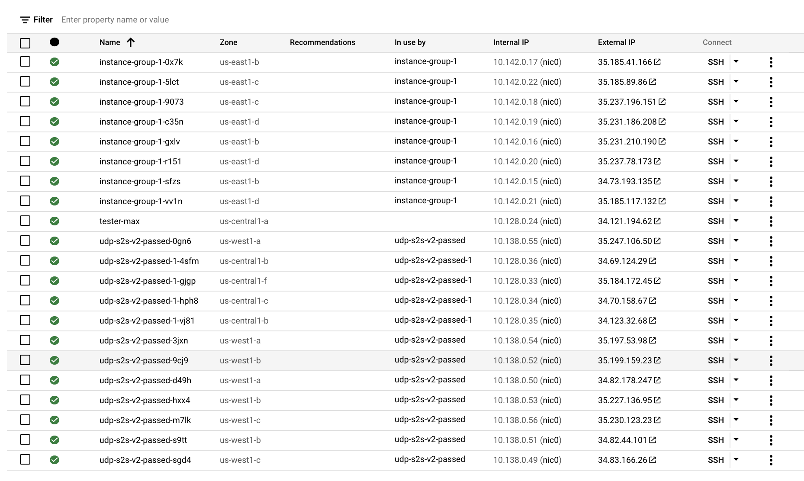
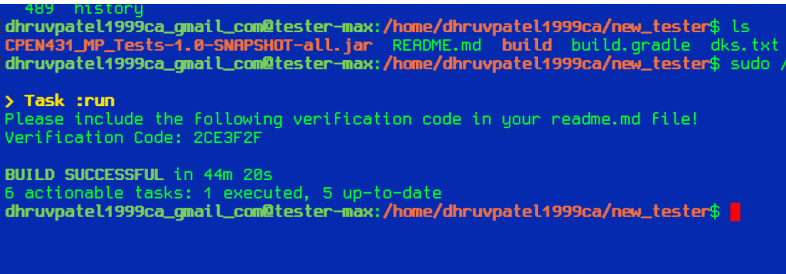

# Test Setup

TEST SETUP 

On GCP E2 Micros Deployed with containier optimized OS >> AT

8 servers US east 

4 servers US central 

8 servers US west




# Verification code




# output log


```shell
cat results.log && tail -f results.log
CPEN 431 Test Client
Time: Tue Mar 23 01:18:54 UTC 2021
Build Date: Mon Mar 22 23:52:32 UTC 2021
Java process ID: 54902
Running test in local mode! Milestone2.
[Milestone2 Tests]
Secret: 0
Exclude 256 clients tests: false
Checking if the test client is running on GC
Unable to determine instance type.
Are you sure you are running the test client on an GC instance?

Done building node list.
The deployment has 20 server nodes.

[ TEST Single Front-End Performance (1 clients, 60.0 seconds): PUT -> GET (closed loop) ]
Secret: 0
Exclude 256 clients tests: false
Checking if the test client is running on GC
Unable to determine instance type.
Are you sure you are running the test client on an GC instance?

Done building node list.
The deployment has 20 server nodes.

[ TEST Single Front-End Performance (1 clients, 60.0 seconds): PUT -> GET (closed loop) ]
Checking if server(s) are up...
Checking if server is up...
[Test isAlive]
[ ... Completed in 0.486 seconds ]
[OK]
[ ... Completed in 0.497 seconds ]
[OK]
Stage 1 Single Front-End: Test Status: TEST_PASSED
Clients: 1
Total Requests (without replies): 168
Total Requests (including replies): 237
Successful Responses: 168
Timeout Responses: 0
Total Failed Responses: 0
% Success: 100.0
% Timeout: 0.0
% Failed: 0.0
Response Time (Successful requests):
[max] 394ms, [min] 0ms
[avg] 195.08333333333334 ms, [stdev] 106.40065882508759ms
Throughput: 2.7683941665980063 requests per second
Goodput: 2.7683941665980063 requests per second
Retry Rate (Successful requests): 1.4107142857142858
Sending WIPE-OUT to all servers...
[ ... Completed in 0.642 seconds ]
[OK]
[ ... TEST Completed in 62.064 seconds ]

[ TEST Single Front-End Performance (16 clients, 60.0 seconds): PUT -> GET (closed loop) ]
Checking if server(s) are up...
Checking if server is up...
[Test isAlive]
[ ... Completed in 0.51 seconds ]
[OK]
[ ... Completed in 0.511 seconds ]
[OK]
Stage 1 Single Front-End: Test Status: TEST_PASSED
Clients: 16
Total Requests (without replies): 2720
Total Requests (including replies): 3780
Successful Responses: 2720
Timeout Responses: 0
Total Failed Responses: 0
% Success: 100.0
% Timeout: 0.0
% Failed: 0.0
Response Time (Successful requests):
[max] 401ms, [min] 0ms
[avg] 197.8625 ms, [stdev] 110.54696329501729ms
Throughput: 44.86523933625837 requests per second
Goodput: 44.86523933625837 requests per second
Retry Rate (Successful requests): 1.3897058823529411
Sending WIPE-OUT to all servers...
[ ... Completed in 0.613 seconds ]
[OK]
[ ... TEST Completed in 61.763 seconds ]

[ TEST Single Front-End Performance (32 clients, 60.0 seconds): PUT -> GET (closed loop) ]
Checking if server(s) are up...
Checking if server is up...
[Test isAlive]
[ ... Completed in 0.419 seconds ]
[OK]
[ ... Completed in 0.421 seconds ]
[OK]
Stage 1 Single Front-End: Test Status: TEST_PASSED
Clients: 32
Total Requests (without replies): 5444
Total Requests (including replies): 7544
Successful Responses: 5444
Timeout Responses: 0
Total Failed Responses: 0
% Success: 100.0
% Timeout: 0.0
% Failed: 0.0
Response Time (Successful requests):
[max] 404ms, [min] 0ms
[avg] 200.55051432770023 ms, [stdev] 109.29455269339668ms
Throughput: 89.6781207788357 requests per second
Goodput: 89.6781207788357 requests per second
Retry Rate (Successful requests): 1.3857457751653197
Sending WIPE-OUT to all servers...
[ ... Completed in 0.618 seconds ]
[OK]
[ ... TEST Completed in 61.762 seconds ]

[ TEST Random Front-End Performance (1 clients, 60.0 seconds): PUT -> GET (closed loop) ]
Checking if server(s) are up...
Checking if server is up...
[Test isAlive]
Checking if server is up...
[Test isAlive]
Checking if server is up...
[Test isAlive]
Checking if server is up...
Checking if server is up...
[Test isAlive]
Checking if server is up...
[Test isAlive]
[Test isAlive]
Checking if server is up...
[Test isAlive]
Checking if server is up...
[Test isAlive]
Checking if server is up...
[Test isAlive]
Checking if server is up...
[Test isAlive]
Checking if server is up...
[Test isAlive]
Checking if server is up...
[Test isAlive]
Checking if server is up...
[Test isAlive]
Checking if server is up...
[Test isAlive]
Checking if server is up...
[Test isAlive]
Checking if server is up...
[Test isAlive]
Checking if server is up...
[Test isAlive]
Checking if server is up...
[Test isAlive]
Checking if server is up...
[Test isAlive]
Checking if server is up...
[Test isAlive]
[ ... Completed in 0.145 seconds ]
[OK]
[ ... Completed in 0.172 seconds ]
[OK]
[ ... Completed in 0.212 seconds ]
[OK]
[ ... Completed in 0.244 seconds ]
[OK]
[ ... Completed in 0.266 seconds ]
[OK]
[ ... Completed in 0.294 seconds ]
[OK]
[ ... Completed in 0.296 seconds ]
[OK]
[ ... Completed in 0.329 seconds ]
[OK]
[ ... Completed in 0.34 seconds ]
[OK]
[ ... Completed in 0.349 seconds ]
[OK]
[ ... Completed in 0.359 seconds ]
[OK]
[ ... Completed in 0.356 seconds ]
[OK]
[ ... Completed in 0.378 seconds ]
[OK]
[ ... Completed in 0.373 seconds ]
[OK]
[ ... Completed in 0.396 seconds ]
[OK]
[ ... Completed in 0.445 seconds ]
[OK]
[ ... Completed in 0.452 seconds ]
[OK]
[ ... Completed in 0.468 seconds ]
[OK]
[ ... Completed in 0.562 seconds ]
[OK]
[ ... Completed in 0.58 seconds ]
[OK]
[ ... Completed in 0.582 seconds ]
[OK]
TEST_PASSED
Stage 1 Random Front-End: Test Status: TEST_PASSED
Clients: 1
Total Requests (without replies): 168
Total Requests (including replies): 232
Successful Responses: 168
Timeout Responses: 0
Total Failed Responses: 0
% Success: 100.0
% Timeout: 0.0
% Failed: 0.0
Response Time (Successful requests):
[max] 393ms, [min] 4ms
[avg] 208.85714285714286 ms, [stdev] 112.96234548113208ms
Throughput: 2.7648859484546264 requests per second
Goodput: 2.7648859484546264 requests per second
Retry Rate (Successful requests): 1.380952380952381
Sending WIPE-OUT to all servers...
[ ... Completed in 0.62 seconds ]
[OK]
[ ... TEST Completed in 61.973 seconds ]

[ TEST Random Front-End Performance (16 clients, 60.0 seconds): PUT -> GET (closed loop) ]
Checking if server(s) are up...
Checking if server is up...
[Test isAlive]
Checking if server is up...
[Test isAlive]
Checking if server is up...
[Test isAlive]
Checking if server is up...
[Test isAlive]
Checking if server is up...
[Test isAlive]
Checking if server is up...
[Test isAlive]
Checking if server is up...
[Test isAlive]
Checking if server is up...
[Test isAlive]
Checking if server is up...
[Test isAlive]
Checking if server is up...
[Test isAlive]
Checking if server is up...
[Test isAlive]
Checking if server is up...
[Test isAlive]
Checking if server is up...
[Test isAlive]
Checking if server is up...
[Test isAlive]
Checking if server is up...
Checking if server is up...
[Test isAlive]
Checking if server is up...
[Test isAlive]
[Test isAlive]
Checking if server is up...
[Test isAlive]
Checking if server is up...
[Test isAlive]
Checking if server is up...
[Test isAlive]
[ ... Completed in 0.098 seconds ]
[OK]
[ ... Completed in 0.126 seconds ]
[OK]
[ ... Completed in 0.161 seconds ]
[OK]
[ ... Completed in 0.217 seconds ]
[OK]
[ ... Completed in 0.245 seconds ]
[OK]
[ ... Completed in 0.248 seconds ]
[OK]
[ ... Completed in 0.282 seconds ]
[OK]
[ ... Completed in 0.291 seconds ]
[OK]
[ ... Completed in 0.305 seconds ]
[OK]
[ ... Completed in 0.305 seconds ]
[OK]
[ ... Completed in 0.319 seconds ]
[OK]
[ ... Completed in 0.329 seconds ]
[OK]
[ ... Completed in 0.348 seconds ]
[OK]
[ ... Completed in 0.395 seconds ]
[OK]
[ ... Completed in 0.419 seconds ]
[OK]
[ ... Completed in 0.444 seconds ]
[OK]
[ ... Completed in 0.511 seconds ]
[OK]
[ ... Completed in 0.526 seconds ]
[OK]
[ ... Completed in 0.548 seconds ]
[OK]
[ ... Completed in 0.654 seconds ]
[OK]
[ ... Completed in 0.659 seconds ]
[OK]
TEST_PASSED
Stage 1 Random Front-End: Test Status: TEST_PASSED
Clients: 16
Total Requests (without replies): 2654
Total Requests (including replies): 3714
Successful Responses: 2654
Timeout Responses: 0
Total Failed Responses: 0
% Success: 100.0
% Timeout: 0.0
% Failed: 0.0
Response Time (Successful requests):
[max] 493ms, [min] 0ms
[avg] 204.55275056518462 ms, [stdev] 115.69944255649106ms
Throughput: 43.44338773305397 requests per second
Goodput: 43.44338773305397 requests per second
Retry Rate (Successful requests): 1.3993971363978899
Sending WIPE-OUT to all servers...
[ ... Completed in 0.6 seconds ]
[OK]
[ ... TEST Completed in 62.369 seconds ]

[ TEST Random Front-End Performance (32 clients, 60.0 seconds): PUT -> GET (closed loop) ]
Checking if server(s) are up...
Checking if server is up...
[Test isAlive]
Checking if server is up...
[Test isAlive]
Checking if server is up...
[Test isAlive]
Checking if server is up...
[Test isAlive]
Checking if server is up...
[Test isAlive]
Checking if server is up...
[Test isAlive]
Checking if server is up...
[Test isAlive]
Checking if server is up...
[Test isAlive]
Checking if server is up...
[Test isAlive]
Checking if server is up...
[Test isAlive]
Checking if server is up...
[Test isAlive]
Checking if server is up...
[Test isAlive]
Checking if server is up...
[Test isAlive]
Checking if server is up...
[Test isAlive]
Checking if server is up...
[Test isAlive]
Checking if server is up...
[Test isAlive]
Checking if server is up...
[Test isAlive]
Checking if server is up...
[Test isAlive]
Checking if server is up...
[Test isAlive]
Checking if server is up...
[Test isAlive]
[ ... Completed in 0.095 seconds ]
[OK]
[ ... Completed in 0.181 seconds ]
[OK]
[ ... Completed in 0.214 seconds ]
[OK]
[ ... Completed in 0.225 seconds ]
[OK]
[ ... Completed in 0.242 seconds ]
[OK]
[ ... Completed in 0.255 seconds ]
[OK]
[ ... Completed in 0.281 seconds ]
[OK]
[ ... Completed in 0.31 seconds ]
[OK]
[ ... Completed in 0.33 seconds ]
[OK]
[ ... Completed in 0.38 seconds ]
[OK]
[ ... Completed in 0.396 seconds ]
[OK]
[ ... Completed in 0.427 seconds ]
[OK]
[ ... Completed in 0.445 seconds ]
[OK]
[ ... Completed in 0.461 seconds ]
[OK]
[ ... Completed in 0.486 seconds ]
[OK]
[ ... Completed in 0.494 seconds ]
[OK]
[ ... Completed in 0.511 seconds ]
[OK]
[ ... Completed in 0.533 seconds ]
[OK]
[ ... Completed in 0.589 seconds ]
[OK]
[ ... Completed in 0.603 seconds ]
[OK]
[ ... Completed in 0.609 seconds ]
[OK]
TEST_PASSED
[ CPU load (loadavg, last one minute) 0.05 ]
Stage 1 Random Front-End: Test Status: TEST_PASSED
Clients: 32
Total Requests (without replies): 5314
Total Requests (including replies): 7431
Successful Responses: 5314
Timeout Responses: 0
Total Failed Responses: 0
% Success: 100.0
% Timeout: 0.0
% Failed: 0.0
Response Time (Successful requests):
[max] 494ms, [min] 0ms
[avg] 204.26477229958599 ms, [stdev] 114.28389439521258ms
Throughput: 87.06194603273424 requests per second
Goodput: 87.06194603273424 requests per second
Retry Rate (Successful requests): 1.3983816334211516
Sending WIPE-OUT to all servers...
[ ... Completed in 0.568 seconds ]
[OK]
[ ... TEST Completed in 62.25 seconds ]

[ TEST Random Front-End Performance (64 clients, 60.0 seconds): PUT -> GET (closed loop) ]
Checking if server(s) are up...
Checking if server is up...
[Test isAlive]
Checking if server is up...
Checking if server is up...
[Test isAlive]
Checking if server is up...
[Test isAlive]
[Test isAlive]
Checking if server is up...
[Test isAlive]
Checking if server is up...
[Test isAlive]
Checking if server is up...
[Test isAlive]
Checking if server is up...
[Test isAlive]
Checking if server is up...
[Test isAlive]
Checking if server is up...
[Test isAlive]
Checking if server is up...
[Test isAlive]
Checking if server is up...
Checking if server is up...
Checking if server is up...
[Test isAlive]
Checking if server is up...
Checking if server is up...
[Test isAlive]
Checking if server is up...
[Test isAlive]
[Test isAlive]
[Test isAlive]
[Test isAlive]
Checking if server is up...
[Test isAlive]
Checking if server is up...
[Test isAlive]
Checking if server is up...
[Test isAlive]
[ ... Completed in 0.129 seconds ]
[OK]
[ ... Completed in 0.182 seconds ]
[OK]
[ ... Completed in 0.21 seconds ]
[OK]
[ ... Completed in 0.244 seconds ]
[OK]
[ ... Completed in 0.255 seconds ]
[OK]
[ ... Completed in 0.271 seconds ]
[OK]
[ ... Completed in 0.269 seconds ]
[OK]
[ ... Completed in 0.286 seconds ]
[OK]
[ ... Completed in 0.314 seconds ]
[OK]
[ ... Completed in 0.338 seconds ]
[OK]
[ ... Completed in 0.361 seconds ]
[OK]
[ ... Completed in 0.383 seconds ]
[OK]
[ ... Completed in 0.408 seconds ]
[OK]
[ ... Completed in 0.456 seconds ]
[OK]
[ ... Completed in 0.477 seconds ]
[OK]
[ ... Completed in 0.49 seconds ]
[OK]
[ ... Completed in 0.508 seconds ]
[OK]
[ ... Completed in 0.543 seconds ]
[OK]
[ ... Completed in 0.564 seconds ]
[OK]
[ ... Completed in 0.617 seconds ]
[OK]
[ ... Completed in 0.621 seconds ]
[OK]
TEST_PASSED
[ CPU load (loadavg, last one minute) 0.04 ]
Stage 1 Random Front-End: Test Status: TEST_PASSED
Clients: 64
Total Requests (without replies): 10572
Total Requests (including replies): 14780
Successful Responses: 10572
Timeout Responses: 0
Total Failed Responses: 0
% Success: 100.0
% Timeout: 0.0
% Failed: 0.0
Response Time (Successful requests):
[max] 696ms, [min] 0ms
[avg] 205.86681800983732 ms, [stdev] 117.82748395110896ms
Throughput: 173.29443005606007 requests per second
Goodput: 173.29443005606007 requests per second
Retry Rate (Successful requests): 1.3980325387816874
Sending WIPE-OUT to all servers...
[ ... Completed in 0.598 seconds ]
[OK]
[ ... TEST Completed in 72.249 seconds ]

[ TEST Random Front-End Performance (128 clients, 60.0 seconds): PUT -> GET (closed loop) ]
Checking if server(s) are up...
Checking if server is up...
[Test isAlive]
Checking if server is up...
[Test isAlive]
Checking if server is up...
[Test isAlive]
Checking if server is up...
Checking if server is up...
[Test isAlive]
Checking if server is up...
[Test isAlive]
[Test isAlive]
Checking if server is up...
[Test isAlive]
Checking if server is up...
Checking if server is up...
Checking if server is up...
[Test isAlive]
Checking if server is up...
[Test isAlive]
Checking if server is up...
[Test isAlive]
Checking if server is up...
[Test isAlive]
Checking if server is up...
[Test isAlive]
Checking if server is up...
[Test isAlive]
Checking if server is up...
[Test isAlive]
Checking if server is up...
[Test isAlive]
Checking if server is up...
[Test isAlive]
Checking if server is up...
Checking if server is up...
[Test isAlive]
[Test isAlive]
[Test isAlive]
[Test isAlive]
[ ... Completed in 0.123 seconds ]
[OK]
[ ... Completed in 0.15 seconds ]
[OK]
[ ... Completed in 0.185 seconds ]
[OK]
[ ... Completed in 0.22 seconds ]
[OK]
[ ... Completed in 0.243 seconds ]
[OK]
[ ... Completed in 0.267 seconds ]
[OK]
[ ... Completed in 0.268 seconds ]
[OK]
[ ... Completed in 0.306 seconds ]
[OK]
[ ... Completed in 0.319 seconds ]
[OK]
[ ... Completed in 0.33 seconds ]
[OK]
[ ... Completed in 0.331 seconds ]
[OK]
[ ... Completed in 0.349 seconds ]
[OK]
[ ... Completed in 0.349 seconds ]
[OK]
[ ... Completed in 0.373 seconds ]
[OK]
[ ... Completed in 0.417 seconds ]
[OK]
[ ... Completed in 0.428 seconds ]
[OK]
[ ... Completed in 0.444 seconds ]
[OK]
[ ... Completed in 0.535 seconds ]
[OK]
[ ... Completed in 0.549 seconds ]
[OK]
[ ... Completed in 0.571 seconds ]
[OK]
[ ... Completed in 0.572 seconds ]
[OK]
TEST_PASSED
[ CPU load (loadavg, last one minute) 0.04 ]
Stage 1 Random Front-End: Test Status: TEST_PASSED
Clients: 128
Total Requests (without replies): 15775
Total Requests (including replies): 23989
Successful Responses: 15585
Timeout Responses: 190
Total Failed Responses: 0
% Success: 98.79556259904913
% Timeout: 1.2044374009508716
% Failed: 0.0
Response Time (Successful requests):
[max] 847ms, [min] 0ms
[avg] 228.2912415784408 ms, [stdev] 133.97698868551714ms
Throughput: 253.62551850541817 requests per second
Goodput: 250.57075790218335 requests per second
Retry Rate (Successful requests): 1.5206973058637083
Sending WIPE-OUT to all servers...
[ ... Completed in 0.589 seconds ]
[OK]
[ ... TEST Completed in 83.398 seconds ]

[ TEST Random Front-End Performance (256 clients, 60.0 seconds): PUT -> GET (closed loop) ]
Checking if server(s) are up...
Checking if server is up...
Checking if server is up...
[Test isAlive]
Checking if server is up...
[Test isAlive]
Checking if server is up...
[Test isAlive]
[Test isAlive]
Checking if server is up...
Checking if server is up...
[Test isAlive]
Checking if server is up...
[Test isAlive]
[Test isAlive]
Checking if server is up...
[Test isAlive]
Checking if server is up...
[Test isAlive]
Checking if server is up...
[Test isAlive]
Checking if server is up...
[Test isAlive]
Checking if server is up...
[Test isAlive]
Checking if server is up...
[Test isAlive]
Checking if server is up...
[Test isAlive]
Checking if server is up...
[Test isAlive]
Checking if server is up...
[Test isAlive]
Checking if server is up...
[Test isAlive]
Checking if server is up...
[Test isAlive]
Checking if server is up...
[Test isAlive]
Checking if server is up...
[Test isAlive]
[ ... Completed in 0.127 seconds ]
[OK]
[ ... Completed in 0.15 seconds ]
[OK]
[ ... Completed in 0.186 seconds ]
[OK]
[ ... Completed in 0.22 seconds ]
[OK]
[ ... Completed in 0.24 seconds ]
[OK]
[ ... Completed in 0.268 seconds ]
[OK]
[ ... Completed in 0.267 seconds ]
[OK]
[ ... Completed in 0.302 seconds ]
[OK]
[ ... Completed in 0.313 seconds ]
[OK]
[ ... Completed in 0.33 seconds ]
[OK]
[ ... Completed in 0.327 seconds ]
[OK]
[ ... Completed in 0.353 seconds ]
[OK]
[ ... Completed in 0.345 seconds ]
[OK]
[ ... Completed in 0.373 seconds ]
[OK]
[ ... Completed in 0.42 seconds ]
[OK]
[ ... Completed in 0.429 seconds ]
[OK]
[ ... Completed in 0.442 seconds ]
[OK]
[ ... Completed in 0.536 seconds ]
[OK]
[ ... Completed in 0.552 seconds ]
[OK]
[ ... Completed in 0.572 seconds ]
[OK]
[ ... Completed in 0.574 seconds ]
[OK]
TEST_PASSED
[ CPU load (loadavg, last one minute) 0.27 ]
Stage 1 Random Front-End: Test Status: TEST_PASSED
Clients: 256
Total Requests (without replies): 18949
Total Requests (including replies): 34034
Successful Responses: 17692
Timeout Responses: 1257
Total Failed Responses: 0
% Success: 93.36640455960736
% Timeout: 6.633595440392633
% Failed: 0.0
Response Time (Successful requests):
[max] 851ms, [min] 0ms
[avg] 251.6989034591906 ms, [stdev] 150.52331974239834ms
Throughput: 302.9610206887731 requests per second
Goodput: 282.8638122341956 requests per second
Retry Rate (Successful requests): 1.7960842260805319
Sending WIPE-OUT to all servers...
[ ... Completed in 0.586 seconds ]
[OK]
[ ... TEST Completed in 93.752 seconds ]

[ TEST Capacity Insert (Value Size = 1000 bytes, Limit = 10000 PUTs, ~9.54 MiB) ]
Issuing puts...
[DONE in 308.843s]
Confirming...
[DONE in 158.521s]
TEST_PASSED
[ ... TEST Completed in 467.382 seconds ]
First crash test: to shutdown - 3 nodes.

[ TEST Crash; Key Recovery ]
Checking if server(s) are up...
Checking if server is up...
[Test isAlive]
Checking if server is up...
[Test isAlive]
Checking if server is up...
[Test isAlive]
[ ... Completed in 0.102 seconds ]
[OK]
[ ... Completed in 0.274 seconds ]
[OK]
[ ... Completed in 0.338 seconds ]
[OK]
[ ... Completed in 0.34 seconds ]
[OK]
Checking if server(s) are up...
Checking if server is up...
Checking if server is up...
Checking if server is up...
[Test isAlive]
[Test isAlive]
[Test isAlive]
Checking if server is up...
[Test isAlive]
Checking if server is up...
[Test isAlive]
Checking if server is up...
Checking if server is up...
Checking if server is up...
[Test isAlive]
[Test isAlive]
[Test isAlive]
Checking if server is up...
[Test isAlive]
Checking if server is up...
[Test isAlive]
Checking if server is up...
Checking if server is up...
[Test isAlive]
Checking if server is up...
[Test isAlive]
[Test isAlive]
Checking if server is up...
[Test isAlive]
Checking if server is up...
Checking if server is up...
[Test isAlive]
Checking if server is up...
[Test isAlive]
[Test isAlive]
[ ... Completed in 0.147 seconds ]
[OK]
[ ... Completed in 0.202 seconds ]
[OK]
[ ... Completed in 0.228 seconds ]
[OK]
[ ... Completed in 0.301 seconds ]
[OK]
[ ... Completed in 0.331 seconds ]
[OK]
[ ... Completed in 0.347 seconds ]
[OK]
[ ... Completed in 0.349 seconds ]
[OK]
[ ... Completed in 0.364 seconds ]
[OK]
[ ... Completed in 0.385 seconds ]
[OK]
[ ... Completed in 0.399 seconds ]
[OK]
[ ... Completed in 0.409 seconds ]
[OK]
[ ... Completed in 0.412 seconds ]
[OK]
[ ... Completed in 0.429 seconds ]
[OK]
[ ... Completed in 0.452 seconds ]
[OK]
[ ... Completed in 0.508 seconds ]
[OK]
[ ... Completed in 0.522 seconds ]
[OK]
[ ... Completed in 0.627 seconds ]
[OK]
[ ... Completed in 0.63 seconds ]
[OK]
Determining if storage was successful...
[DONE in 155.073s]
Sending SHUTDOWN to 3 servers.
[ ... Completed in 3.807 seconds ]
Checking if server(s) are up...
[Test isAlive]
[Test isAlive]
[Test isAlive]
Request Timeout.
Request Timeout.
Request Timeout.
Request Timeout.
Request Timeout.
Request Timeout.
Request Timeout.
Request Timeout.
Request Timeout.
Request Timeout.
Request Timeout.
Request Timeout.
Request Timeout.
Request Timeout.
Request Timeout.
Request Timeout.
Request Timeout.
Request Timeout.
Request Timeout.
Request Timeout.
Request Timeout.
Request Timeout.
Request Timeout.
Request Timeout.
Request Timeout.
Request Timeout.
Request Timeout.
Request Timeout.
Request Timeout.
Request Timeout.
[ ... Completed in 38.046 seconds ]
[OK]
Checking if server(s) are up...
Checking if server is up...
[Test isAlive]
Checking if server is up...
Checking if server is up...
Checking if server is up...
[Test isAlive]
Checking if server is up...
[Test isAlive]
[Test isAlive]
[Test isAlive]
Checking if server is up...
Checking if server is up...
[Test isAlive]
Checking if server is up...
Checking if server is up...
Checking if server is up...
[Test isAlive]
[Test isAlive]
[Test isAlive]
[Test isAlive]
Checking if server is up...
[Test isAlive]
Checking if server is up...
[Test isAlive]
Checking if server is up...
[Test isAlive]
Checking if server is up...
[Test isAlive]
Checking if server is up...
Checking if server is up...
Checking if server is up...
[Test isAlive]
[Test isAlive]
[Test isAlive]
[ ... Completed in 0.121 seconds ]
[OK]
[ ... Completed in 0.166 seconds ]
[OK]
[ ... Completed in 0.197 seconds ]
[OK]
[ ... Completed in 0.254 seconds ]
[OK]
[ ... Completed in 0.263 seconds ]
[OK]
[ ... Completed in 0.283 seconds ]
[OK]
[ ... Completed in 0.284 seconds ]
[OK]
[ ... Completed in 0.299 seconds ]
[OK]
[ ... Completed in 0.322 seconds ]
[OK]
[ ... Completed in 0.334 seconds ]
[OK]
[ ... Completed in 0.337 seconds ]
[OK]
[ ... Completed in 0.35 seconds ]
[OK]
[ ... Completed in 0.352 seconds ]
[OK]
[ ... Completed in 0.366 seconds ]
[OK]
[ ... Completed in 0.388 seconds ]
[OK]
[ ... Completed in 0.459 seconds ]
[OK]
[ ... Completed in 0.564 seconds ]
[OK]
[ ... Completed in 0.566 seconds ]
[OK]
Attempting retrieval of keys...
[DONE in 158.693s]
Checking if server(s) are up...
[Test isAlive]
[Test isAlive]
[Test isAlive]
Request Timeout.
Request Timeout.
Request Timeout.
Request Timeout.
Request Timeout.
Request Timeout.
Request Timeout.
Request Timeout.
Request Timeout.
Request Timeout.
Request Timeout.
Request Timeout.
Request Timeout.
Request Timeout.
Request Timeout.
Request Timeout.
Request Timeout.
Request Timeout.
Request Timeout.
Request Timeout.
Request Timeout.
Request Timeout.
Request Timeout.
Request Timeout.
Request Timeout.
Request Timeout.
Request Timeout.
Request Timeout.
Request Timeout.
Request Timeout.
[ ... Completed in 38.048 seconds ]
[OK]
Checking if server(s) are up...
Checking if server is up...
Checking if server is up...
[Test isAlive]
Checking if server is up...
[Test isAlive]
Checking if server is up...
[Test isAlive]
[Test isAlive]
Checking if server is up...
Checking if server is up...
Checking if server is up...
[Test isAlive]
Checking if server is up...
[Test isAlive]
Checking if server is up...
Checking if server is up...
[Test isAlive]
Checking if server is up...
[Test isAlive]
[Test isAlive]
[Test isAlive]
Checking if server is up...
[Test isAlive]
[Test isAlive]
Checking if server is up...
[Test isAlive]
Checking if server is up...
[Test isAlive]
Checking if server is up...
[Test isAlive]
Checking if server is up...
[Test isAlive]
Checking if server is up...
[Test isAlive]
[ ... Completed in 0.107 seconds ]
[OK]
[ ... Completed in 0.139 seconds ]
[OK]
[ ... Completed in 0.201 seconds ]
[OK]
[ ... Completed in 0.23 seconds ]
[OK]
[ ... Completed in 0.264 seconds ]
[OK]
[ ... Completed in 0.276 seconds ]
[OK]
[ ... Completed in 0.288 seconds ]
[OK]
[ ... Completed in 0.288 seconds ]
[OK]
[ ... Completed in 0.308 seconds ]
[OK]
[ ... Completed in 0.314 seconds ]
[OK]
[ ... Completed in 0.331 seconds ]
[OK]
[ ... Completed in 0.402 seconds ]
[OK]
[ ... Completed in 0.43 seconds ]
[OK]
[ ... Completed in 0.475 seconds ]
[OK]
[ ... Completed in 0.491 seconds ]
[OK]
[ ... Completed in 0.506 seconds ]
[OK]
[ ... Completed in 0.527 seconds ]
[OK]
[ ... Completed in 0.528 seconds ]
[OK]
Of 10000 usable puts:
Failed: 15 Timed out: 0 Invalid value: 0
Expecting 15.0% keys to fail. Actual failed: 0.15%
Keys failed after server crash : 0.15%
TEST_PASSED
Second crash test: to shutdown - 3 nodes.

[ TEST Crash; Key Recovery ]
Checking if server(s) are up...
Checking if server is up...
[Test isAlive]
Checking if server is up...
[Test isAlive]
Checking if server is up...
[Test isAlive]
[ ... Completed in 0.211 seconds ]
[OK]
[ ... Completed in 0.253 seconds ]
[OK]
[ ... Completed in 0.439 seconds ]
[OK]
[ ... Completed in 0.441 seconds ]
[OK]
Checking if server(s) are up...
Checking if server is up...
Checking if server is up...
[Test isAlive]
Checking if server is up...
[Test isAlive]
Checking if server is up...
[Test isAlive]
[Test isAlive]
Checking if server is up...
[Test isAlive]
Checking if server is up...
Checking if server is up...
[Test isAlive]
Checking if server is up...
[Test isAlive]
Checking if server is up...
[Test isAlive]
Checking if server is up...
[Test isAlive]
[Test isAlive]
Checking if server is up...
Checking if server is up...
[Test isAlive]
[Test isAlive]
Checking if server is up...
[Test isAlive]
Checking if server is up...
[Test isAlive]
[ ... Completed in 0.113 seconds ]
[OK]
[ ... Completed in 0.143 seconds ]
[OK]
[ ... Completed in 0.208 seconds ]
[OK]
[ ... Completed in 0.231 seconds ]
[OK]
[ ... Completed in 0.231 seconds ]
[OK]
[ ... Completed in 0.281 seconds ]
[OK]
[ ... Completed in 0.29 seconds ]
[OK]
[ ... Completed in 0.295 seconds ]
[OK]
[ ... Completed in 0.309 seconds ]
[OK]
[ ... Completed in 0.339 seconds ]
[OK]
[ ... Completed in 0.409 seconds ]
[OK]
[ ... Completed in 0.433 seconds ]
[OK]
[ ... Completed in 0.51 seconds ]
[OK]
[ ... Completed in 0.531 seconds ]
[OK]
[ ... Completed in 0.532 seconds ]
[OK]
Determining if storage was successful...
[DONE in 155.079s]
Sending SHUTDOWN to 3 servers.
[ ... Completed in 3.805 seconds ]
Checking if server(s) are up...
[Test isAlive]
[Test isAlive]
[Test isAlive]
Request Timeout.
Request Timeout.
Request Timeout.
Request Timeout.
Request Timeout.
Request Timeout.
Request Timeout.
Request Timeout.
Request Timeout.
Request Timeout.
Request Timeout.
Request Timeout.
Request Timeout.
Request Timeout.
Request Timeout.
Request Timeout.
Request Timeout.
Request Timeout.
Request Timeout.
Request Timeout.
Request Timeout.
Request Timeout.
Request Timeout.
Request Timeout.
Request Timeout.
Request Timeout.
Request Timeout.
Request Timeout.
Request Timeout.
Request Timeout.
[ ... Completed in 38.048 seconds ]
[OK]
Checking if server(s) are up...
Checking if server is up...
[Test isAlive]
Checking if server is up...
Checking if server is up...
[Test isAlive]
Checking if server is up...
[Test isAlive]
Checking if server is up...
[Test isAlive]
Checking if server is up...
[Test isAlive]
[Test isAlive]
Checking if server is up...
[Test isAlive]
Checking if server is up...
[Test isAlive]
Checking if server is up...
[Test isAlive]
Checking if server is up...
Checking if server is up...
Checking if server is up...
[Test isAlive]
Checking if server is up...
[Test isAlive]
Checking if server is up...
[Test isAlive]
[Test isAlive]
[Test isAlive]
[ ... Completed in 0.167 seconds ]
[OK]
[ ... Completed in 0.238 seconds ]
[OK]
[ ... Completed in 0.263 seconds ]
[OK]
[ ... Completed in 0.299 seconds ]
[OK]
[ ... Completed in 0.314 seconds ]
[OK]
[ ... Completed in 0.322 seconds ]
[OK]
[ ... Completed in 0.325 seconds ]
[OK]
[ ... Completed in 0.344 seconds ]
[OK]
[ ... Completed in 0.369 seconds ]
[OK]
[ ... Completed in 0.44 seconds ]
[OK]
[ ... Completed in 0.473 seconds ]
[OK]
[ ... Completed in 0.542 seconds ]
[OK]
[ ... Completed in 0.564 seconds ]
[OK]
[ ... Completed in 0.572 seconds ]
[OK]
[ ... Completed in 0.575 seconds ]
[OK]
Attempting retrieval of keys...
[DONE in 157.662s]
Checking if server(s) are up...
[Test isAlive]
[Test isAlive]
[Test isAlive]
Request Timeout.
Request Timeout.
Request Timeout.
Request Timeout.
Request Timeout.
Request Timeout.
Request Timeout.
Request Timeout.
Request Timeout.
Request Timeout.
Request Timeout.
Request Timeout.
Request Timeout.
Request Timeout.
Request Timeout.
Request Timeout.
Request Timeout.
Request Timeout.
Request Timeout.
Request Timeout.
Request Timeout.
Request Timeout.
Request Timeout.
Request Timeout.
Request Timeout.
Request Timeout.
Request Timeout.
Request Timeout.
Request Timeout.
Request Timeout.
[ ... Completed in 38.047 seconds ]
[OK]
Checking if server(s) are up...
Checking if server is up...
[Test isAlive]
Checking if server is up...
Checking if server is up...
Checking if server is up...
[Test isAlive]
Checking if server is up...
[Test isAlive]
[Test isAlive]
[Test isAlive]
Checking if server is up...
[Test isAlive]
Checking if server is up...
Checking if server is up...
[Test isAlive]
Checking if server is up...
[Test isAlive]
Checking if server is up...
Checking if server is up...
Checking if server is up...
[Test isAlive]
Checking if server is up...
[Test isAlive]
[Test isAlive]
Checking if server is up...
[Test isAlive]
[Test isAlive]
[Test isAlive]
[ ... Completed in 0.131 seconds ]
[OK]
[ ... Completed in 0.204 seconds ]
[OK]
[ ... Completed in 0.226 seconds ]
[OK]
[ ... Completed in 0.27 seconds ]
[OK]
[ ... Completed in 0.278 seconds ]
[OK]
[ ... Completed in 0.29 seconds ]
[OK]
[ ... Completed in 0.291 seconds ]
[OK]
[ ... Completed in 0.309 seconds ]
[OK]
[ ... Completed in 0.332 seconds ]
[OK]
[ ... Completed in 0.407 seconds ]
[OK]
[ ... Completed in 0.428 seconds ]
[OK]
[ ... Completed in 0.507 seconds ]
[OK]
[ ... Completed in 0.53 seconds ]
[OK]
[ ... Completed in 0.559 seconds ]
[OK]
[ ... Completed in 0.56 seconds ]
[OK]
Of 10000 usable puts:
Failed: 2934 Timed out: 0 Invalid value: 0
Expecting 17.647058823529413% keys to fail. Actual failed: 29.34%
Keys failed after server crash : 29.34%
TEST_PASSED
Sending WIPE-OUT to all servers...
[ ... Completed in 0.593 seconds ]
[OK]
[ ... TEST Completed in 395.348 seconds ]

[ TEST Single Front-End Performance (1 clients, 60.0 seconds): PUT -> GET (closed loop) ]
Checking if server(s) are up...
Checking if server is up...
[Test isAlive]
[ ... Completed in 0.491 seconds ]
[OK]
[ ... Completed in 0.493 seconds ]
[OK]
Stage 2 Single Front-End: Test Status: TEST_PASSED
Clients: 1
Total Requests (without replies): 154
Total Requests (including replies): 220
Successful Responses: 154
Timeout Responses: 0
Total Failed Responses: 0
% Success: 100.0
% Timeout: 0.0
% Failed: 0.0
Response Time (Successful requests):
[max] 404ms, [min] 7ms
[avg] 220.2792207792208 ms, [stdev] 109.93330308266704ms
Throughput: 2.550302227374348 requests per second
Goodput: 2.550302227374348 requests per second
Retry Rate (Successful requests): 1.4285714285714286
Sending WIPE-OUT to all servers...
[ ... Completed in 0.62 seconds ]
[OK]
[ ... TEST Completed in 61.5 seconds ]

[ TEST Single Front-End Performance (16 clients, 60.0 seconds): PUT -> GET (closed loop) ]
Checking if server(s) are up...
Checking if server is up...
[Test isAlive]
[ ... Completed in 0.397 seconds ]
[OK]
[ ... Completed in 0.399 seconds ]
[OK]
Stage 2 Single Front-End: Test Status: TEST_PASSED
Clients: 16
Total Requests (without replies): 2560
Total Requests (including replies): 3544
Successful Responses: 2560
Timeout Responses: 0
Total Failed Responses: 0
% Success: 100.0
% Timeout: 0.0
% Failed: 0.0
Response Time (Successful requests):
[max] 409ms, [min] 0ms
[avg] 222.8328125 ms, [stdev] 104.06084166049084ms
Throughput: 41.983042786624466 requests per second
Goodput: 41.983042786624466 requests per second
Retry Rate (Successful requests): 1.384375
Sending WIPE-OUT to all servers...
[ ... Completed in 0.553 seconds ]
[OK]
[ ... TEST Completed in 61.93 seconds ]

[ TEST Single Front-End Performance (32 clients, 60.0 seconds): PUT -> GET (closed loop) ]
Checking if server(s) are up...
Checking if server is up...
[Test isAlive]
[ ... Completed in 0.398 seconds ]
[OK]
[ ... Completed in 0.399 seconds ]
[OK]
Stage 2 Single Front-End: Test Status: TEST_PASSED
Clients: 32
Total Requests (without replies): 5148
Total Requests (including replies): 7144
Successful Responses: 5148
Timeout Responses: 0
Total Failed Responses: 0
% Success: 100.0
% Timeout: 0.0
% Failed: 0.0
Response Time (Successful requests):
[max] 575ms, [min] 0ms
[avg] 219.77583527583528 ms, [stdev] 103.64987545107445ms
Throughput: 84.67662346206987 requests per second
Goodput: 84.67662346206987 requests per second
Retry Rate (Successful requests): 1.3877233877233877
Sending WIPE-OUT to all servers...
[ ... Completed in 0.55 seconds ]
[OK]
[ ... TEST Completed in 61.751 seconds ]

[ TEST Random Front-End Performance (1 clients, 60.0 seconds): PUT -> GET (closed loop) ]
Checking if server(s) are up...
Checking if server is up...
Checking if server is up...
[Test isAlive]
[Test isAlive]
Checking if server is up...
[Test isAlive]
Checking if server is up...
[Test isAlive]
Checking if server is up...
[Test isAlive]
Checking if server is up...
[Test isAlive]
Checking if server is up...
[Test isAlive]
Checking if server is up...
[Test isAlive]
Checking if server is up...
[Test isAlive]
Checking if server is up...
Checking if server is up...
[Test isAlive]
Checking if server is up...
[Test isAlive]
[Test isAlive]
Checking if server is up...
[Test isAlive]
Checking if server is up...
[Test isAlive]
[ ... Completed in 0.146 seconds ]
[OK]
[ ... Completed in 0.183 seconds ]
[OK]
[ ... Completed in 0.251 seconds ]
[OK]
[ ... Completed in 0.323 seconds ]
[OK]
[ ... Completed in 0.348 seconds ]
[OK]
[ ... Completed in 0.385 seconds ]
[OK]
[ ... Completed in 0.398 seconds ]
[OK]
[ ... Completed in 0.407 seconds ]
[OK]
[ ... Completed in 0.411 seconds ]
[OK]
[ ... Completed in 0.427 seconds ]
[OK]
[ ... Completed in 0.452 seconds ]
[OK]
[ ... Completed in 0.523 seconds ]
[OK]
[ ... Completed in 0.549 seconds ]
[OK]
[ ... Completed in 0.625 seconds ]
[OK]
[ ... Completed in 0.628 seconds ]
[OK]
TEST_PASSED
Stage 2 Random Front-End: Test Status: TEST_PASSED
Clients: 1
Total Requests (without replies): 160
Total Requests (including replies): 230
Successful Responses: 160
Timeout Responses: 0
Total Failed Responses: 0
% Success: 100.0
% Timeout: 0.0
% Failed: 0.0
Response Time (Successful requests):
[max] 404ms, [min] 3ms
[avg] 199.8625 ms, [stdev] 110.30352938029678ms
Throughput: 2.6646237884288713 requests per second
Goodput: 2.6646237884288713 requests per second
Retry Rate (Successful requests): 1.4375
Sending WIPE-OUT to all servers...
[ ... Completed in 0.548 seconds ]
[OK]
[ ... TEST Completed in 61.223 seconds ]

[ TEST Random Front-End Performance (16 clients, 60.0 seconds): PUT -> GET (closed loop) ]
Checking if server(s) are up...
Checking if server is up...
Checking if server is up...
[Test isAlive]
Checking if server is up...
[Test isAlive]
Checking if server is up...
Checking if server is up...
[Test isAlive]
Checking if server is up...
[Test isAlive]
Checking if server is up...
[Test isAlive]
Checking if server is up...
[Test isAlive]
Checking if server is up...
[Test isAlive]
Checking if server is up...
[Test isAlive]
Checking if server is up...
[Test isAlive]
[Test isAlive]
[Test isAlive]
Checking if server is up...
[Test isAlive]
Checking if server is up...
[Test isAlive]
Checking if server is up...
[Test isAlive]
[ ... Completed in 0.179 seconds ]
[OK]
[ ... Completed in 0.249 seconds ]
[OK]
[ ... Completed in 0.273 seconds ]
[OK]
[ ... Completed in 0.31 seconds ]
[OK]
[ ... Completed in 0.324 seconds ]
[OK]
[ ... Completed in 0.336 seconds ]
[OK]
[ ... Completed in 0.334 seconds ]
[OK]
[ ... Completed in 0.351 seconds ]
[OK]
[ ... Completed in 0.357 seconds ]
[OK]
[ ... Completed in 0.378 seconds ]
[OK]
[ ... Completed in 0.451 seconds ]
[OK]
[ ... Completed in 0.475 seconds ]
[OK]
[ ... Completed in 0.552 seconds ]
[OK]
[ ... Completed in 0.576 seconds ]
[OK]
[ ... Completed in 0.576 seconds ]
[OK]
TEST_PASSED
Stage 2 Random Front-End: Test Status: TEST_PASSED
Clients: 16
Total Requests (without replies): 2566
Total Requests (including replies): 3687
Successful Responses: 2566
Timeout Responses: 0
Total Failed Responses: 0
% Success: 100.0
% Timeout: 0.0
% Failed: 0.0
Response Time (Successful requests):
[max] 427ms, [min] 1ms
[avg] 201.19563522992985 ms, [stdev] 113.41402193141899ms
Throughput: 42.312512367258094 requests per second
Goodput: 42.312512367258094 requests per second
Retry Rate (Successful requests): 1.4368667186282151
Sending WIPE-OUT to all servers...
[ ... Completed in 0.553 seconds ]
[OK]
[ ... TEST Completed in 61.777 seconds ]

[ TEST Random Front-End Performance (32 clients, 60.0 seconds): PUT -> GET (closed loop) ]
Checking if server(s) are up...
Checking if server is up...
[Test isAlive]
Checking if server is up...
[Test isAlive]
Checking if server is up...
[Test isAlive]
Checking if server is up...
Checking if server is up...
[Test isAlive]
[Test isAlive]
Checking if server is up...
[Test isAlive]
Checking if server is up...
[Test isAlive]
Checking if server is up...
[Test isAlive]
Checking if server is up...
[Test isAlive]
Checking if server is up...
[Test isAlive]
Checking if server is up...
Checking if server is up...
Checking if server is up...
[Test isAlive]
[Test isAlive]
[Test isAlive]
Checking if server is up...
[Test isAlive]
[ ... Completed in 0.228 seconds ]
[OK]
[ ... Completed in 0.24 seconds ]
[OK]
[ ... Completed in 0.257 seconds ]
[OK]
[ ... Completed in 0.332 seconds ]
[OK]
[ ... Completed in 0.379 seconds ]
[OK]
[ ... Completed in 0.4 seconds ]
[OK]
[ ... Completed in 0.426 seconds ]
[OK]
[ ... Completed in 0.457 seconds ]
[OK]
[ ... Completed in 0.465 seconds ]
[OK]
[ ... Completed in 0.485 seconds ]
[OK]
[ ... Completed in 0.486 seconds ]
[OK]
[ ... Completed in 0.506 seconds ]
[OK]
[ ... Completed in 0.533 seconds ]
[OK]
[ ... Completed in 0.612 seconds ]
[OK]
[ ... Completed in 0.614 seconds ]
[OK]
TEST_PASSED
[ CPU load (loadavg, last one minute) 0.08 ]
Stage 2 Random Front-End: Test Status: TEST_PASSED
Clients: 32
Total Requests (without replies): 5118
Total Requests (including replies): 7392
Successful Responses: 5118
Timeout Responses: 0
Total Failed Responses: 0
% Success: 100.0
% Timeout: 0.0
% Failed: 0.0
Response Time (Successful requests):
[max] 444ms, [min] 0ms
[avg] 199.32610394685423 ms, [stdev] 113.42103823077807ms
Throughput: 83.96082484374232 requests per second
Goodput: 83.96082484374232 requests per second
Retry Rate (Successful requests): 1.444314185228605
Sending WIPE-OUT to all servers...
[ ... Completed in 0.591 seconds ]
[OK]
[ ... TEST Completed in 62.173 seconds ]

[ TEST Random Front-End Performance (64 clients, 60.0 seconds): PUT -> GET (closed loop) ]
Checking if server(s) are up...
Checking if server is up...
[Test isAlive]
Checking if server is up...
Checking if server is up...
[Test isAlive]
[Test isAlive]
Checking if server is up...
[Test isAlive]
Checking if server is up...
[Test isAlive]
Checking if server is up...
[Test isAlive]
Checking if server is up...
[Test isAlive]
Checking if server is up...
[Test isAlive]
Checking if server is up...
Checking if server is up...
[Test isAlive]
Checking if server is up...
[Test isAlive]
Checking if server is up...
[Test isAlive]
Checking if server is up...
[Test isAlive]
[Test isAlive]
Checking if server is up...
[Test isAlive]
[ ... Completed in 0.178 seconds ]
[OK]
[ ... Completed in 0.249 seconds ]
[OK]
[ ... Completed in 0.272 seconds ]
[OK]
[ ... Completed in 0.312 seconds ]
[OK]
[ ... Completed in 0.325 seconds ]
[OK]
[ ... Completed in 0.332 seconds ]
[OK]
[ ... Completed in 0.338 seconds ]
[OK]
[ ... Completed in 0.351 seconds ]
[OK]
[ ... Completed in 0.355 seconds ]
[OK]
[ ... Completed in 0.38 seconds ]
[OK]
[ ... Completed in 0.456 seconds ]
[OK]
[ ... Completed in 0.474 seconds ]
[OK]
[ ... Completed in 0.552 seconds ]
[OK]
[ ... Completed in 0.575 seconds ]
[OK]
[ ... Completed in 0.577 seconds ]
[OK]
TEST_PASSED
[ CPU load (loadavg, last one minute) 0.02 ]
Stage 2 Random Front-End: Test Status: TEST_PASSED
Clients: 64
Total Requests (without replies): 9962
Total Requests (including replies): 14535
Successful Responses: 9962
Timeout Responses: 0
Total Failed Responses: 0
% Success: 100.0
% Timeout: 0.0
% Failed: 0.0
Response Time (Successful requests):
[max] 766ms, [min] 0ms
[avg] 203.86709496085123 ms, [stdev] 115.63092902859171ms
Throughput: 163.45885634588564 requests per second
Goodput: 163.45885634588564 requests per second
Retry Rate (Successful requests): 1.4590443686006827
Sending WIPE-OUT to all servers...
[ ... Completed in 0.614 seconds ]
[OK]
[ ... TEST Completed in 72.146 seconds ]

[ TEST Random Front-End Performance (128 clients, 60.0 seconds): PUT -> GET (closed loop) ]
Checking if server(s) are up...
Checking if server is up...
[Test isAlive]
Checking if server is up...
[Test isAlive]
Checking if server is up...
[Test isAlive]
Checking if server is up...
[Test isAlive]
Checking if server is up...
[Test isAlive]
Checking if server is up...
[Test isAlive]
Checking if server is up...
[Test isAlive]
Checking if server is up...
[Test isAlive]
Checking if server is up...
[Test isAlive]
Checking if server is up...
[Test isAlive]
Checking if server is up...
[Test isAlive]
Checking if server is up...
[Test isAlive]
Checking if server is up...
[Test isAlive]
Checking if server is up...
[Test isAlive]
[ ... Completed in 0.2 seconds ]
[OK]
[ ... Completed in 0.269 seconds ]
[OK]
[ ... Completed in 0.294 seconds ]
[OK]
[ ... Completed in 0.331 seconds ]
[OK]
[ ... Completed in 0.344 seconds ]
[OK]
[ ... Completed in 0.348 seconds ]
[OK]
[ ... Completed in 0.355 seconds ]
[OK]
[ ... Completed in 0.357 seconds ]
[OK]
[ ... Completed in 0.374 seconds ]
[OK]
[ ... Completed in 0.373 seconds ]
[OK]
[ ... Completed in 0.401 seconds ]
[OK]
[ ... Completed in 0.47 seconds ]
[OK]
[ ... Completed in 0.496 seconds ]
[OK]
[ ... Completed in 0.573 seconds ]
[OK]
[ ... Completed in 0.576 seconds ]
[OK]
TEST_PASSED
[ CPU load (loadavg, last one minute) 0.07 ]
Stage 2 Random Front-End: Test Status: TEST_PASSED
Clients: 128
Total Requests (without replies): 14113
Total Requests (including replies): 22903
Successful Responses: 13893
Timeout Responses: 220
Total Failed Responses: 0
% Success: 98.44115354637569
% Timeout: 1.558846453624318
% Failed: 0.0
Response Time (Successful requests):
[max] 819ms, [min] 0ms
[avg] 229.3307421003383 ms, [stdev] 138.28909619540624ms
Throughput: 229.3901566868214 requests per second
Goodput: 225.81431636434561 requests per second
Retry Rate (Successful requests): 1.622830014879898
Sending WIPE-OUT to all servers...
[ ... Completed in 0.565 seconds ]
[OK]
[ ... TEST Completed in 82.68 seconds ]

[ TEST Random Front-End Performance (256 clients, 60.0 seconds): PUT -> GET (closed loop) ]
Checking if server(s) are up...
Checking if server is up...
[Test isAlive]
Checking if server is up...
[Test isAlive]
Checking if server is up...
[Test isAlive]
Checking if server is up...
[Test isAlive]
Checking if server is up...
[Test isAlive]
Checking if server is up...
Checking if server is up...
[Test isAlive]
Checking if server is up...
[Test isAlive]
Checking if server is up...
[Test isAlive]
[Test isAlive]
Checking if server is up...
[Test isAlive]
Checking if server is up...
[Test isAlive]
Checking if server is up...
[Test isAlive]
Checking if server is up...
[Test isAlive]
Checking if server is up...
[Test isAlive]
[ ... Completed in 0.209 seconds ]
[OK]
[ ... Completed in 0.243 seconds ]
[OK]
[ ... Completed in 0.313 seconds ]
[OK]
[ ... Completed in 0.36 seconds ]
[OK]
[ ... Completed in 0.381 seconds ]
[OK]
[ ... Completed in 0.407 seconds ]
[OK]
[ ... Completed in 0.438 seconds ]
[OK]
[ ... Completed in 0.445 seconds ]
[OK]
[ ... Completed in 0.461 seconds ]
[OK]
[ ... Completed in 0.467 seconds ]
[OK]
[ ... Completed in 0.472 seconds ]
[OK]
[ ... Completed in 0.489 seconds ]
[OK]
[ ... Completed in 0.514 seconds ]
[OK]
[ ... Completed in 0.587 seconds ]
[OK]
[ ... Completed in 0.589 seconds ]
[OK]
TEST_PASSED
[ CPU load (loadavg, last one minute) 0.12 ]
Stage 2 Random Front-End: Test Status: TEST_PASSED
Clients: 256
Total Requests (without replies): 17125
Total Requests (including replies): 32793
Successful Responses: 15867
Timeout Responses: 1258
Total Failed Responses: 0
% Success: 92.65401459854014
% Timeout: 7.3459854014598545
% Failed: 0.0
Response Time (Successful requests):
[max] 842ms, [min] 0ms
[avg] 257.3838784899477 ms, [stdev] 161.3123604066761ms
Throughput: 274.12280701754383 requests per second
Goodput: 253.98578563196313 requests per second
Retry Rate (Successful requests): 1.914919708029197
Sending WIPE-OUT to all servers...
[ ... Completed in 0.584 seconds ]
[OK]
[ ... TEST Completed in 93.674 seconds ]
Checking if server(s) are up...
[Test isAlive]
[Test isAlive]
[Test isAlive]
Request Timeout.
Request Timeout.
Request Timeout.
Request Timeout.
Request Timeout.
Request Timeout.
Request Timeout.
Request Timeout.
Request Timeout.
Request Timeout.
Request Timeout.
Request Timeout.
Request Timeout.
Request Timeout.
Request Timeout.
Request Timeout.
Request Timeout.
Request Timeout.
Request Timeout.
Request Timeout.
Request Timeout.
Request Timeout.
Request Timeout.
Request Timeout.
Request Timeout.
Request Timeout.
Request Timeout.
Request Timeout.
Request Timeout.
Request Timeout.
[ ... Completed in 38.047 seconds ]
[OK]
[ ... TEST Completed in 38.048 seconds ]
Completed Milestone2 Tests.
Testing completed in 2657.295s
```


